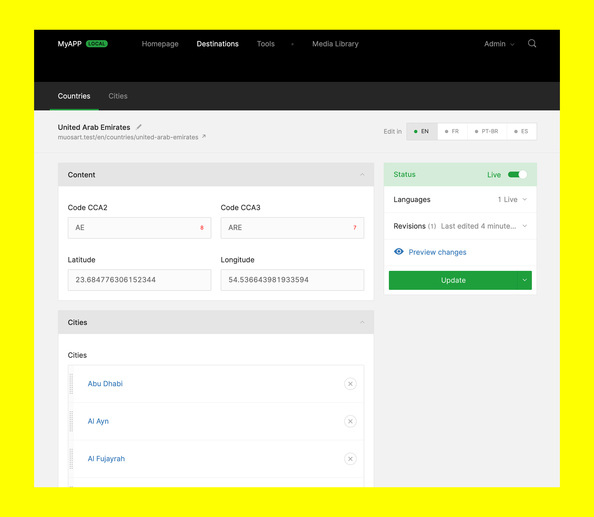

# Countries Capsule

### A [Twill Capsule](https://github.com/area17/twill) to help you manage a list of Countries



### Description

This is a simple and translatable list of countries.

**Please make sure your users have the proper permissions to edit/unpublish the homepage.**

## Installing

You can clone, copy the zip or do it via

```
php artisan twill:capsule:install countries
```

Enable the Capsule adding it to `config/twill.php`

``` php
return [
    'destinations' => [
        'title' => 'Destinations',

        'route' => 'admin.destinations.countries.index',

        'primary_navigation' => [
            'countries' => [
                'title' => 'Countries',
                'module' => true,
            ],

            'cities' => [
                'title' => 'Cities',
                'module' => true,
            ],
        ],
    ],
];
```

## Navigation

Add this to `twill-navigation.php` to make your homepage link go directly to the edit page:

``` php
return [
    'countries' => [
        'title' => 'Countries',

        'module' => true,
    ],
]
```

## Seeder

This Capsule contains a seeder to seed countries and countries, to use use it, you just need to call on your `databaase/seeders/DatabaseSeeder.php`:

``` php
<?php

namespace Database\Seeders;

use Illuminate\Database\Seeder;
use App\Twill\Capsules\Countries\Database\Seeds\DatabaseSeeder as CountriesDatabaseSeeder;

class DatabaseSeeder extends Seeder
{
    /**
     * Seed the application's database.
     *
     * @return void
     */
    public function run()
    {
        app(CountriesDatabaseSeeder::class)->run();
    }
}
```

It depends on [Countries](https://packagist.org/packages/pragmarx/countries) and [ForceUTF8](https://github.com/neitanod/forceutf8) packages that can be installed using:

``` bash
composer require pragmarx/countries
composer require neitanod/forceutf8
```

## Dependencies

- Depends on the [Twill Capsules Base](https://github.com/area17/twill-capsule-base) repository.
- Depends on the [Twill Capsules Countries](https://github.com/area17/twill-capsule-countries) repository.
